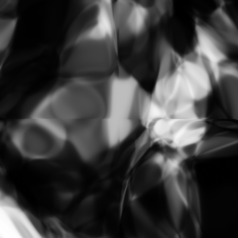
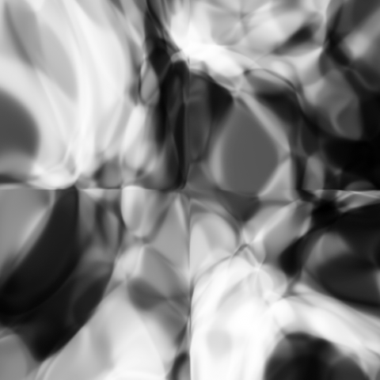
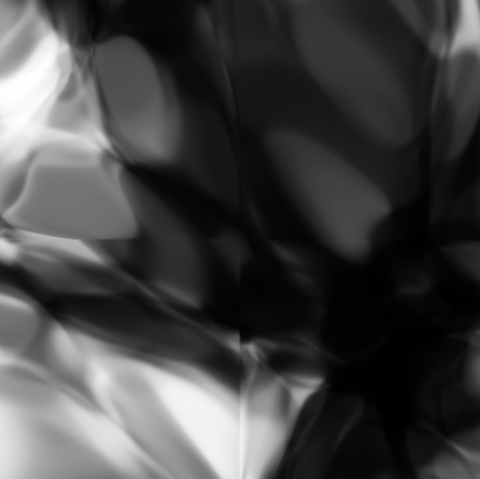

<a href="https://github.com/codekansas/gandlf/blob/master/examples/mnist_upsampled.py" class="icon icon-github"> mnist_upsample.py</a>

This example is a Gandlf implementation of the blog post [Generating Large Images from Latent Vectors](http://blog.otoro.net/2016/04/01/generating-large-images-from-latent-vectors/). The generator model is trained to take `(x, y)` coordinates and predict the value at that point, to match MNIST digits. The discriminator model takes `(x, y)` coordinates and the value, and decides if the value is realistic or not. Both models also receive information about the class

This approach makes the input space continuous `(x, y)` values rather than discrete points, which means you can sample from intermediate values to scale the image up. For more details, consult the linked blog post.

The images below show samples from the model before training:

The trained samples are a work in progress (waiting on access to a GPU). If you run it and get interesting results, send them my way! Otherwise, hopefully I'll have these updated in a month or so. This model could also be adapted to work with the CIFAR dataset, which can easily be imported in Keras.
