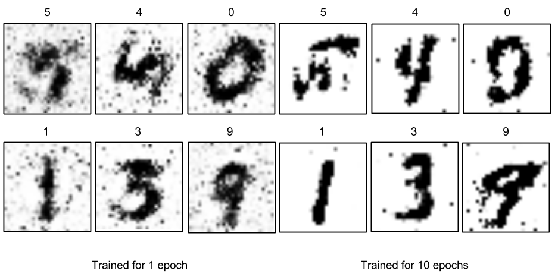

[mnist_gan.py](https://github.com/codekansas/gandlf/blob/master/examples/mnist_gan.py)

This example illustrates how to use a Gandlf model to generate MNIST digits. The model can be run in supervised mode (where the discriminator and generator know the desired class labels) or unsupervised mode (which is a more pure GAN implementation).

This example is a Gandlf implementation of the Keras MNIST ACGAN example, which can be found [here](https://github.com/fchollet/keras/blob/master/examples/mnist_acgan.py). One important distinction is that Gandlf runs the generator and discriminator updates in parallel rather than sequentially; this can't be done in Keras normally.

TODO: Add images sampled from this model.

In addition to the convolutional model, a simple feed-forward model can be used for the discriminator and generator which can be trained much more quickly (feasible to run it on a laptop). The samples below show randomly sampled generated images from the lite model, which took about 100 seconds per epoch on a Macbook Pro.

The gif below shows the representation of a 6 when the model is fed latent vectors that interpret between two points. Becuase the lite model is not convolutional, the interpolation is not very smoothe.

