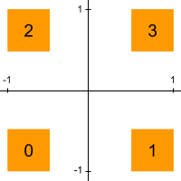

This example can be run quickly on a CPU, and is a good demonstration of one of the tricky parts about training GANs. The input data consists of four uniform distributions, centered near `(-1, -1)`, `(1, -1)`, `(-1, 1)` and `(1, 1)`. This is illustrated in the figure below, which each of the distributions labeled.

The model can either be trained in unsupervised mode or supervised mode. In the supervised mode, it acts as an auxiliary classifier GAN, which explicitly says which distribution the generated data should come from.

When trained in the unsupervised mode, the data tends to cluster in one of the distributions. A potential way to fix this would be to let the GAN look at a whole batch of data, which would let it know that it's clustering too much on one distribution.

