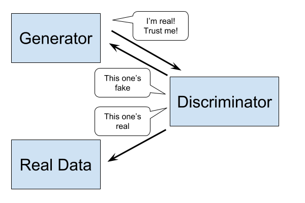

## Generative Adversarial Network Deep Learning Framework

>He that breaks a thing to find out what it is has left the path of wisdom.
>(Tim Peters, Council of Elrond Style Guide)

This is a framework built on top of [Keras](https://github.com/fchollet/keras) for training [Generative Adversarial Networks](https://arxiv.org/abs/1406.2661).

Because it's built on top of Keras, it has the benefits of being *modular*, *minimal* and *extensible*, running on both CPU and GPU using either Tensorflow or Theano.

## Installation

Using Pip:

````sh
pip install git+https://github.com/codekansas/gandlf
pip install h5py  # To save and load Keras models
````

Installing from source:

````sh
git clone https://github.com/codekansas/gandlf
cd gandlf
pip install -r requirements.txt
python setup.py install
````

## Quick Start

Below demonstrates how a Gandlf model works.

````python
import keras
import gandlf

def build_generator():
    latent_vec = keras.layers.Input(shape=..., name='latent_vec')
    output_layer = keras.layers.Dense(...)(latent_vec)
    return keras.models.Model(input=[latent_vec], output=[output_layer])

def build_discriminator():
    data_input = keras.layers.Input(shape=..., name='data_input')
    output_layer = keras.layers.Dense(...)(data_input)
    return keras.models.Model(input=[data_input], output=[output_layer])

model = gandlf.Model(generator=build_generator(),
                     discriminator=build_discriminator())

model.compile(optimizer='adam', loss='binary_crossentropy')

# Latent vector is fed data from a random normal distribution.
# <input_data> represents the real data.
# 'zeros' and 'ones' represent 'real' and 'fake', respectively.
# In this case, the discriminator learns 'real data' -> 0
# and 'generated data' -> 1, while the generator learns
# 'generated data' -> 0.
model.fit(['normal', <input_data>], ['zeros', 'ones'])

# The model provides a function for predicting the discriminator's
# output on some input data, which is useful for auxiliary classification.
model_predictions = model.predict([<input_data>])

# The model also provides a function for sampling from the generator.
generated_data = model.sample(['normal'], num_samples=10)

# Under the hood, other functions work like their Keras counterparts.
model.save('/save/path')
````

## Guiding Principles

In no particular order:

 - *Keras-esque*: The APIs should feel familiar for Keras users, with some minor changes.
 - *Powerful*: Models should support a wide variety of GAN architectures.
 - *Extensible*: Models should be easy to modify for different experiments.

## What is a GAN?

GAN stands for Generative Adversarial Network. The graphic below provides a scientific illustration of what a GAN does.



The GAN consists of two neural networks: a generator and a discriminator. The discriminator's job is to take in some real data and some fake data and decide which one is which. The generator's job is to generate good enough fake data that the discriminator can't tell the difference.

GANs were introduced by Ian Goodfellow in an [eponymous paper](https://arxiv.org/abs/1406.2661). Since then, many researchers have come up with different architectures and tricks to improve training. Gandlf aims to make these advancements more accessible and provide a platform for experimenting with different tweaks. It is built on top of the popular [Keras](https://keras.io/) library, and therefore supports training in both Theano and Tensorflow.

## Issues Etiquette

More examples would be awesome! If you use this for something, create a stand-alone script that can be run and I'll put it in the `examples` directory. Just create a pull request for it.

If you encounter an error, I would really like to hear about it! But please raise an issue before creating a pull request, to discuss the error. Even better, look around the code to see if you can spot what's going wrong.

Lastly, there a number of resources available for more general discussion; here is a list, again in no particular order:

 - [/r/MachineLearning](https://www.reddit.com/r/MachineLearning/)
 - [Adversarial Training Facebook Group](https://www.facebook.com/groups/675606912596390/)
