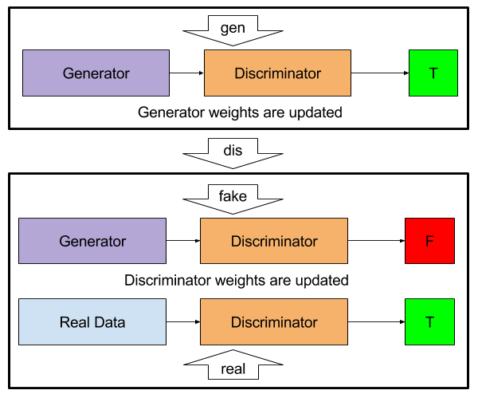

Gandlf models employ a few tricks to make training Generative Adversarial Networks much easier than they would be in conventional Keras code.

## Inputs

> The principle of generating small amounts of finite improbability by simply hooking the logic circuits of a Bambleweeny 57 Sub-Meson Brain to an atomic vector plotter suspended in a strong Brownian Motion producer (say a nice hot cup of tea) were of course well understood...

Conceptually, the Generator part of a Generative Adversarial Network learns to map a random data distribution to the distribution of real data. When building them, you therefore need a good way to produce random latent variables. In Gandlf, this can be done easily, as follows:

````python
latent_vec = keras.layers.Input(shape, name='latent_vec')
generator_model = keras.models.Model(input=[latent_vec], ...)
model = gandlf.Model(generator=generator_model, discriminator=...)
model.compile(optimizer, loss)
model.fit(x=['normal', <real_data>], ...)
````

By specifying `normal` as the input to `latent_vec`, the model will pull random data from a normal distribution to populate the `latent_vec` input whenever it is needed. Similarly, `uniform` can be used for the same purpose. By default, the distribution has a mean of zero and variance of one. To change this, a function can be passed which takes as an argument `batch_size` and returns the desired Numpy array:

````python
import numpy as np
func = lambda batch_size: np.random.normal(loc=1., scale=0.1, size=(batch_size, 3, 4))
model.fit(x=[func, <real_data>], ...)
````

## Modes

Generative adversarial networks have two modes: the generator part and the discriminator part. In Gandlf, the discriminator part is also separated into two modes; learning to push the generated data towards `fake` and to push the real data towards `real`.

A typical discriminator model might have two outputs: one to predict if the sample being recieved is real or fake data, and one to act as an auxiliary classifier (in the example of MNIST digits, the auxiliary classifier might predict which digit the sample belongs to). This can be done in Gandlf as follows:

````python
is_it_real = keras.layers.SomeLayer(..., name='is_it_real')
aux_class = keras.layers.SomeLayer(..., name='aux_class')
discriminator = Model(inputs=[...], outputs=[is_it_real, aux_class])
model = gandlf.Model(generator=..., discriminator=discriminator)
````

One problem is that the outputs have to be specified for each mode. The diagram below illustrates the three training modes:



The suffixes above are used in Gandlf naming to specify the outputs. The example below illustrates how to specify the desired outputs for the `fit` function on the model above:

````python
model.fit(inputs=[...], outputs={
    # Tells the generator to make the discriminator's is_it_real output
    # go towards 1 for generated samples.
    'is_it_real_gen': 'ones',

    # Tells the generator to generate samples that are classified as
    # their correct classification by the discriminator.
    'aux_class_gen': <correct_classes>

    # Tells the discriminator to make the is_it_real output go towards 0
    # for generated samples.
    'is_it_real_fake': 'zeros',

    # Tells the discriminator to classify the fake samples as
    # some class (this can be turned off using loss_weights).
    'aux_class_fake': <some_classes>

    # Tells the discriminator to make the is_it_real output go towards 1
    # for real samples.
    'is_it_real_real': 'ones',

    # Tells the discriminator to classify the real samples as their
    # correct classes.
    'aux_class_real': <correct_classes>
})
````

The `fit` function can be written slightly more compactly by combining the `gen` and `real` target classes. This is written as:

````python
model.fit(inputs=[...], outputs={
    'is_it_real_gen_real': 'ones', 'is_it_real_fake': 'zeros',
    'aux_class_real_gen': <correct_classes>, 'aux_class_fake': <some_classes>,
})
````

Similar shorthand can be used when specifying `optimizer` and `loss` in the `compile` method. For the optimizer, passing a list or tuple of optimizers with length 2 will assign the first optimizer to train the discriminator and the second optimizer to train the generator. For the loss, the same naming conventions apply:

````python
model.compile(optimizer=['adam', 'sgd'], loss={
    'is_it_real': 'binary_crossentropy',
    'aux_class': 'categorical_crossentropy',
})

# This method is equivalent, but much longer and more redundant.
model.compile(optimizer=['adam', 'sgd'], loss={
    'is_it_real_gen': 'binary_crossentropy',
    'is_it_real_real': 'binary_crossentropy',
    'is_it_real_fake': 'binary_crossentropy',

    'aux_class_gen_real': 'categorical_crossentropy',
    'aux_class_fake': 'categorical_crossentropy',
})
````

